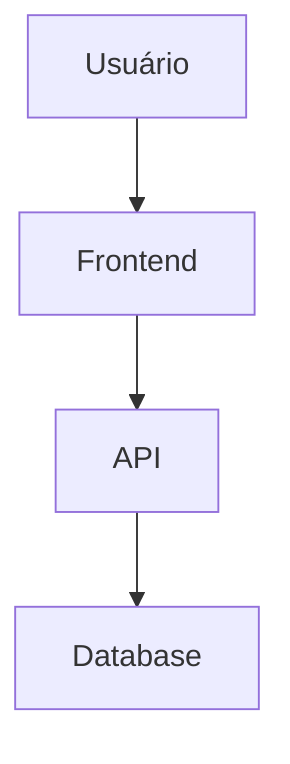

# 📚 SpendWise - Documentação Técnica

Documentação completa do sistema de finanças pessoais SpendWise, desenvolvido com tecnologias modernas e arquitetura limpa.

## 🚀 **Quick Start**

### **Instalação**

```bash
# 1. Clone o repositório
git clone https://github.com/MateusOrlando/SpendWise-Docs.git
cd SpendWise-Docs

# 2. Instale as dependências
pip install -r requirements.txt

# 3. Inicie o servidor de desenvolvimento
mkdocs serve

# 4. Acesse a documentação
# http://localhost:8000
```

### **Build para Produção**

```bash
# Gerar site estático
mkdocs build

# Deploy para GitHub Pages
mkdocs gh-deploy
```

## 📋 **Estrutura da Documentação**

```
docs/
├── 📖 Início
│   └── index.md
├── 🎯 Visão Geral
│   ├── about.md
│   ├── architecture.md
│   └── technologies.md
├── 🔧 Backend
│   ├── index.md
│   ├── clean-architecture.md
│   ├── domain.md
│   ├── application.md
│   ├── infrastructure.md
│   └── api.md
├── ⚛️ Frontend
│   ├── index.md
│   ├── nextjs.md
│   ├── components.md
│   └── api-integration.md
├── 🐳 Docker & DevOps
│   ├── index.md
│   ├── development.md
│   ├── production.md
│   └── cicd.md
├── 📡 API Reference
│   ├── auth.md
│   ├── users.md
│   ├── categories.md
│   ├── transactions.md
│   └── reports.md
├── 📊 Diagramas
│   ├── data-model.md
│   ├── architecture.md
│   └── flows.md
├── 📖 Guias
│   ├── setup.md
│   ├── contributing.md
│   ├── deploy.md
│   └── troubleshooting.md
└── 📋 Especificações
    ├── business-rules.md
    ├── user-stories.md
    └── patterns.md
```

## 🛠️ **Tecnologias Utilizadas**

### **Documentação**
- **MkDocs** - Gerador de documentação estática
- **Material for MkDocs** - Tema moderno e responsivo
- **Mermaid** - Diagramas e fluxos
- **Python** - Ambiente de execução

### **Plugins**
- **awesome-pages** - Navegação avançada
- **git-revision-date-localized** - Datas de modificação
- **git-committers** - Autores dos commits
- **minify** - Otimização de HTML
- **mkdocstrings** - Documentação de código

## 🎨 **Recursos Visuais**

### **Diagramas Mermaid**


### **Admonitions**
!!! info "Informação"
    Este é um bloco de informação.

!!! warning "Atenção"
    Este é um bloco de aviso.

!!! danger "Perigo"
    Este é um bloco de perigo.

### **Tabs**
=== "C#"
    ```csharp
    public class Usuario
    {
        public string Nome { get; set; }
    }
    ```

=== "TypeScript"
    ```typescript
    interface Usuario {
      nome: string;
    }
    ```

## 🔧 **Configuração**

### **mkdocs.yml**
```yaml
site_name: SpendWise - Documentação Técnica
theme:
  name: material
  palette:
    - scheme: default
      primary: indigo
      accent: indigo
```

### **Personalização**
- **Logo**: `docs/assets/logo.png`
- **Favicon**: `docs/assets/favicon.ico`
- **Cores**: Configuráveis no `mkdocs.yml`
- **Navegação**: Estruturada por seções

## 📝 **Contribuição**

### **Adicionando Conteúdo**

1. **Crie um novo arquivo** em `docs/`
2. **Adicione à navegação** no `mkdocs.yml`
3. **Use Markdown** com extensões do Material
4. **Teste localmente** com `mkdocs serve`

### **Padrões de Escrita**

- **Títulos**: Use hierarquia clara (H1 → H2 → H3)
- **Código**: Use blocos de código com syntax highlighting
- **Links**: Use links relativos para navegação
- **Imagens**: Coloque em `docs/assets/`

### **Exemplo de Estrutura**

```markdown
# Título Principal

## Subtítulo

### Seção

Conteúdo da seção com **formatação**.

```csharp
// Exemplo de código
public class Exemplo
{
    public string Propriedade { get; set; }
}
```

!!! tip "Dica"
    Esta é uma dica útil.
```

## 🚀 **Deploy**

### **GitHub Pages**

```bash
# Deploy automático
mkdocs gh-deploy

# Deploy manual
mkdocs build
# Upload da pasta site/ para GitHub Pages
```

### **Outros Provedores**

- **Netlify**: Conecte o repositório
- **Vercel**: Use o template MkDocs
- **Docker**: Containerize a documentação

## 📊 **Métricas**

### **Estatísticas**
- **Páginas**: 25+
- **Seções**: 8 principais
- **Diagramas**: 10+
- **Exemplos de código**: 50+

### **Qualidade**
- **Linting**: Markdown lint configurado
- **Links**: Verificação automática
- **Imagens**: Otimização automática
- **SEO**: Meta tags configuradas

## 🆘 **Suporte**

### **Problemas Comuns**

1. **Erro de instalação**: Verifique a versão do Python
2. **Tema não carrega**: Verifique as dependências
3. **Links quebrados**: Use `mkdocs serve` para testar

### **Recursos**

- **Documentação MkDocs**: https://www.mkdocs.org/
- **Material Theme**: https://squidfunk.github.io/mkdocs-material/
- **Mermaid**: https://mermaid-js.github.io/mermaid/

## 📄 **Licença**

Este projeto é desenvolvido para fins acadêmicos como parte do curso de Técnicas de Programação em Plataformas Emergentes da Universidade de Brasília.

---

**Desenvolvido por**: Mateus Orlando  
**Curso**: TPPE - UNB  
**Período**: 2025.2
