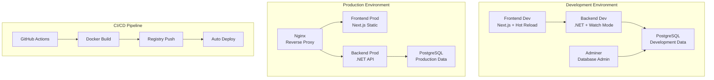

# Docker & DevOps

## 🐳 **Visão Geral**

O SpendWise utiliza Docker para containerização completa, garantindo consistência entre ambientes de desenvolvimento e produção. A infraestrutura é orquestrada com Docker Compose e automatizada com CI/CD.

## 📋 **Pré-requisitos**

- Docker Desktop 4.0+
- Docker Compose v2.0+
- Git
- 8GB RAM disponível
- 10GB espaço em disco

## 🏗️ **Arquitetura Docker**



## 🚀 **Quick Start**

### **Desenvolvimento**

```bash
# 1. Clone o repositório
git clone https://github.com/MateusOrlando/SpendWise.git
cd SpendWise

# 2. Inicie o ambiente de desenvolvimento
./scripts/dev.sh

# 3. Acesse os serviços
# Frontend: http://localhost:3000
# Backend: http://localhost:5000
# Swagger: http://localhost:5000/swagger
# Adminer: http://localhost:8080
```

### **Produção**

```bash
# 1. Configure as variáveis de ambiente
cp .env.example .env
# Edite o arquivo .env com suas configurações

# 2. Inicie o ambiente de produção
./scripts/prod.sh

# 3. Acesse a aplicação
# Aplicação: http://localhost
# API: http://localhost/api
```

## 📁 **Estrutura Docker**

```
SpendWise/
├── 🐳 Docker Files
│   ├── Dockerfile (Backend Prod)
│   ├── Dockerfile.dev (Backend Dev)
│   └── Dockerfile (Frontend Prod)
├── 🐳 Docker Compose
│   ├── docker-compose.dev.yml
│   └── docker-compose.prod.yml
├── 🐳 Nginx
│   └── nginx/nginx.conf
├── 🐳 Scripts
│   ├── dev.sh
│   └── prod.sh
└── 🐳 CI/CD
    └── .github/workflows/ci.yml
```

## 🔧 **Configuração**

### **Variáveis de Ambiente**

#### **Desenvolvimento (.env.dev)**
```env
# Database
POSTGRES_DB=spendwise_dev
POSTGRES_USER=spendwise
POSTGRES_PASSWORD=spendwise123

# Backend
ASPNETCORE_ENVIRONMENT=Development
ConnectionStrings__DefaultConnection=Host=postgres;Port=5432;Database=spendwise_dev;Username=spendwise;Password=spendwise123

# Frontend
NEXT_PUBLIC_API_URL=http://localhost:5000/api
```

#### **Produção (.env.prod)**
```env
# Database
POSTGRES_DB=spendwise_prod
POSTGRES_USER=spendwise
POSTGRES_PASSWORD=your_secure_password_here

# JWT
JWT_SECRET_KEY=your_jwt_secret_key_here_minimum_32_characters
JWT_ISSUER=SpendWise
JWT_AUDIENCE=SpendWise

# Frontend
NEXT_PUBLIC_API_URL=http://localhost:5000/api
```

## 🛠️ **Comandos Úteis**

### **Desenvolvimento**

```bash
# Iniciar ambiente
docker-compose -f docker-compose.dev.yml up -d

# Ver logs
docker-compose -f docker-compose.dev.yml logs -f

# Parar ambiente
docker-compose -f docker-compose.dev.yml down

# Rebuild específico
docker-compose -f docker-compose.dev.yml up --build backend

# Entrar no container
docker-compose -f docker-compose.dev.yml exec backend bash
docker-compose -f docker-compose.dev.yml exec frontend sh

# Ver status
docker-compose -f docker-compose.dev.yml ps
```

### **Produção**

```bash
# Iniciar ambiente
docker-compose -f docker-compose.prod.yml up -d

# Ver logs
docker-compose -f docker-compose.prod.yml logs -f

# Parar ambiente
docker-compose -f docker-compose.prod.yml down

# Restart serviço
docker-compose -f docker-compose.prod.yml restart backend

# Backup banco
docker-compose -f docker-compose.prod.yml exec postgres pg_dump -U spendwise spendwise_prod > backup.sql
```

## 🔍 **Monitoramento**

### **Health Checks**

```bash
# Backend
curl http://localhost:5000/health

# Frontend
curl http://localhost:3000

# Banco de dados
docker-compose -f docker-compose.dev.yml exec postgres pg_isready -U spendwise
```

### **Métricas de Recursos**

```bash
# Uso de CPU e memória
docker stats

# Espaço em disco
docker system df

# Limpeza
docker system prune -a
```

## 🚨 **Troubleshooting**

### **Problemas Comuns**

#### **Porta já em uso**
```bash
# Verificar processos
lsof -i :3000
lsof -i :5000

# Parar processo
kill -9 <PID>
```

#### **Container não inicia**
```bash
# Ver logs detalhados
docker-compose -f docker-compose.dev.yml logs backend

# Rebuild completo
docker-compose -f docker-compose.dev.yml down
docker-compose -f docker-compose.dev.yml up --build --force-recreate
```

#### **Banco de dados não conecta**
```bash
# Verificar se PostgreSQL está rodando
docker-compose -f docker-compose.dev.yml ps postgres

# Ver logs do PostgreSQL
docker-compose -f docker-compose.dev.yml logs postgres

# Resetar banco
docker-compose -f docker-compose.dev.yml down -v
docker-compose -f docker-compose.dev.yml up -d
```

#### **Frontend não carrega**
```bash
# Verificar se backend está rodando
curl http://localhost:5000/health

# Ver logs do frontend
docker-compose -f docker-compose.dev.yml logs frontend

# Rebuild frontend
docker-compose -f docker-compose.dev.yml up --build frontend
```

## 🔒 **Segurança**

### **Produção**

1. **Alterar senhas padrão**
2. **Usar HTTPS**
3. **Configurar firewall**
4. **Backup regular**
5. **Monitorar logs**

### **Variáveis Sensíveis**

- Nunca commitar arquivos `.env`
- Usar secrets do Docker
- Rotacionar chaves JWT regularmente
- Usar Docker secrets para produção

## 📈 **Performance**

### **Otimizações**

1. **Multi-stage builds** para imagens menores
2. **Health checks** para restart automático
3. **Volumes** para persistência de dados
4. **Networks** para isolamento

### **Escalabilidade**

```bash
# Escalar serviços
docker-compose -f docker-compose.prod.yml up --scale backend=3

# Load balancer
# Configurar nginx para balanceamento
```

## 🚀 **CI/CD Pipeline**

### **GitHub Actions**

O pipeline automatizado inclui:

1. **Lint** - Validação de código
2. **Test** - Execução de testes
3. **Build** - Construção de imagens Docker
4. **Push** - Upload para registry
5. **Deploy** - Deploy automático

### **Configuração**

```yaml
# .github/workflows/ci.yml
name: CI/CD Pipeline
on:
  push:
    branches: [ main, develop ]
  pull_request:
    branches: [ main, develop ]

jobs:
  lint-backend:
    runs-on: ubuntu-latest
    steps:
      - uses: actions/checkout@v4
      - name: Setup .NET
        uses: actions/setup-dotnet@v4
        with:
          dotnet-version: '8.0.x'
      - name: Lint
        run: dotnet build --verbosity normal
```

## 📚 **Próximos Passos**

1. **[Desenvolvimento](development.md)** - Configuração detalhada para desenvolvimento
2. **[Produção](production.md)** - Deploy e configuração de produção
3. **[CI/CD](cicd.md)** - Pipeline de integração contínua
4. **[Troubleshooting](troubleshooting.md)** - Resolução de problemas

---

## 🆘 **Suporte**

Para problemas ou dúvidas:

1. Verificar logs dos containers
2. Consultar documentação do Docker
3. Abrir issue no repositório
4. Contatar equipe de desenvolvimento

---

<div class="grid cards" markdown>

-   :material-docker:{ .lg .middle } **Desenvolvimento**

    ---

    Configuração completa para ambiente de desenvolvimento local.

    [:octicons-arrow-right-24: Desenvolvimento](development.md)

-   :material-rocket-launch:{ .lg .middle } **Produção**

    ---

    Deploy e configuração para ambiente de produção.

    [:octicons-arrow-right-24: Produção](production.md)

-   :material-git:{ .lg .middle } **CI/CD**

    ---

    Pipeline de integração contínua e deploy automatizado.

    [:octicons-arrow-right-24: CI/CD](cicd.md)

</div>
